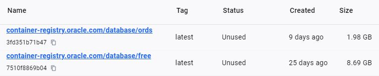

# Install Oracle Database latest "Free" with APEX and ORDS Using Multi-Container Approach on Ubuntu Server 22.04 LTS or Windows

## Introduction
Creating independent containers for different components of an application enhances scalability and simplifies maintenance. This modular approach allows for easier identification and resolution of issues, as well as targeted restarts of problematic containers without affecting the entire system.

## Licenses
### [**Docker**](https://docs.docker.com/get-docker/)
#### Docker Desktop License
Docker Desktop is free for personal use, education, and small businesses (**fewer than 250 employees and less than $10 million in annual revenue**). For larger enterprises, a paid subscription is required.

#### Docker Engine License
Docker Engine is open-source and available under the Apache 2.0 license, which allows for free use, modification, and distribution.

### [**Podman**](https://podman.io/)
#### Podman License
Podman is an alternative to Docker that offers similar functionality with a focus on security and daemonless architecture. Podman is part of the open-source container tools suite provided by Red Hat.
Podman is available under the Apache 2.0 license, **allowing for free use, modification, and distribution**.

## 1. Install Docker
### Windows
[Follow instruction](https://docs.docker.com/desktop/install/windows-install/)
### Ubuntu
```
apt install docker.io -y
```


## 2. Download images
- database/free contains **only** Oracle database
- database/ords contains **only** APEX + ORDS
```
docker pull container-registry.oracle.com/database/free:latest
docker pull container-registry.oracle.com/database/ords:latest
```
Here are the results of the Docker pull commands:


## 3. Run Oracle DB container
### Windows PowerShell multiline command
```
mkdir C:\Docker\volume\oracle-db\db-data\

docker run `
  --name oracledb23.4.0.0 `
  --restart unless-stopped `
  -p 1521:1521 `
  -p 5500:5500 `
  -e ORACLE_PWD=Str0ngP4ssw0rd `
  --memory 8g `
  --cpus 4 `
  -v C:\Docker\volume\oracle-db\db-data:/opt/oracle/oradata `
  container-registry.oracle.com/database/free:latest
```


### Ubuntu bash multiline command
```
mkdir /mnt/docker/oracle-db/db-data/

docker run \
  --name oracledb23.4.0.0 \
  --restart unless-stopped \
  -p 1521:1521 \
  -p 5500:5500 \
  -e ORACLE_PWD=Str0ngP4ssw0rd \
  --memory 8g  \
  --cpus 4  \
  -v /mnt/docker/oracle-db/db-data/:/opt/oracle/oradata \
  container-registry.oracle.com/database/free:latest
```
You can start/stop Oracle DB container like this
```
docker start oracledb23.4.0.0
docker stop oracledb23.4.0.0
```
## 4. Install APEX+ORDS container

### 4.1. Obtain IP of oracle container
We want "bridge network id" and this IP will be used for connection string
```
docker network ls
docker network inspect <network id>
```
Result IP: (172.17.0.2)

### 4.2. Create config for APEX+ORDS installation (it must be user **SYS**)

#### **Windows** create Volumes folders for APEX+ORDS container
```
mkdir C:\Docker\volume\apex-ords\ords_config
mkdir C:\Docker\volume\apex-ords\ords_secrets
```
Create connection string file used for establishing connection from apexords containter to oracle database container. (Client server concept)
```
ECHO "CONN_STRING=sys/Str0ngP4ssw0rd@172.17.0.2:1521/freepdb1" > C:\Docker\volume\apex-ords\ords_secrets\conn_string.txt
```

#### **Ubuntu** create Volumes folders for APEX+ORDS container
```
mkdir /mnt/docker/apex-ords/ords_config
mkdir /mnt/docker/apex-ords/ords_secrets
```
Create connection string file used for establishing connection from apexords containter to oracle database container. (Client server concept)
```
echo 'CONN_STRING=sys/Str0ngP4ssw0rd@172.17.0.2:1521/freepdb1' > /mnt/docker/apex-ords/ords_secrets/conn_string.txt
```
### 4.3. Run APEX+ORDS container
#### **Windows** PowerShell multiline command
```
docker run `
  --name apexords `
  --restart unless-stopped `
  -v C:\Docker\volume\apex-ords\ords_secrets:/opt/oracle/variables `
  -v C:\Docker\volume\apex-ords\ords_config:/etc/ords/config/ `
  -p 8181:8181 `
  --memory 4g `
  --cpus 4 `
  container-registry.oracle.com/database/ords:latest
```
#### **Ubuntu** bash multiline command
```
docker run \
  --name apexords \
  --restart unless-stopped \
  -v /mnt/docker/apex-ords/ords_secrets:/opt/oracle/variables \
  -v /mnt/docker/apex-ords/ords_config:/etc/ords/config/ \
  -p 8181:8181 \
  --memory 4g \
  --cpus 4 \
  container-registry.oracle.com/database/ords:latest
```
You can start/stop Oracle APEX+ORDS container
```
docker start apexords
docker stop apexords
```

APEX will be installed, and REST services will be activated. The configurations will be stored in the volume, so the container can be stopped/started later with docker start/stop ords, retaining the configuration.

Initial data for the installation of APEX with ORDS:
[http://localhost:8181](http://localhost:8181)
- Workspace: internal
- User:      ADMIN
- Password:  Welcome_1


## Confirmation of ORDS Installed 

Open [Oracle SQL Developer](https://planetone.online/downloads/oracle/) and connect to freepdb1

- Connection name: **oracle-db-system**
- Hostname: **localhost**
- Username: **system**
- Password: **Str0ngP4ssw0rd**
- Port: 1521
- Service name: **freepdb1**

It appears: **REST Data Services**

## Create new APEX Workspace
1. **Workspace** name: ProjectName e.g. (UsersOnMap)

2. **Database** 
- Schema Name: **ProjectName** e.g. (UsersOnMap)
- Schema Password: **DatabaseStrongPassword_1**

3. **APEX** Administrator 
- Username: **ProjectUserName** e.g. (admin)
- Administrator Password: **APEXStrongPassword_1**
- Email: **your.email@gmail.com**

### Testing DB creation of new project
In Oracle SQL Developer create new connection
- Connection name: **ProjectName** e.g. (UsersOnMap)
- Hostname: **localhost**
- Username: **ProjectUserName** e.g. (admin)
- Password: **DatabaseStrongPassword_1**
- Port: 1521
- Service name: **freepdb1**


### Testing Login APEX with ORDS:
[http://localhost:8181](http://localhost:8181)
- Workspace: **ProjectName** e.g. (UsersOnMap)
- User:      **ProjectUserName** e.g. (admin)
- Password:  **APEXStrongPassword_1**